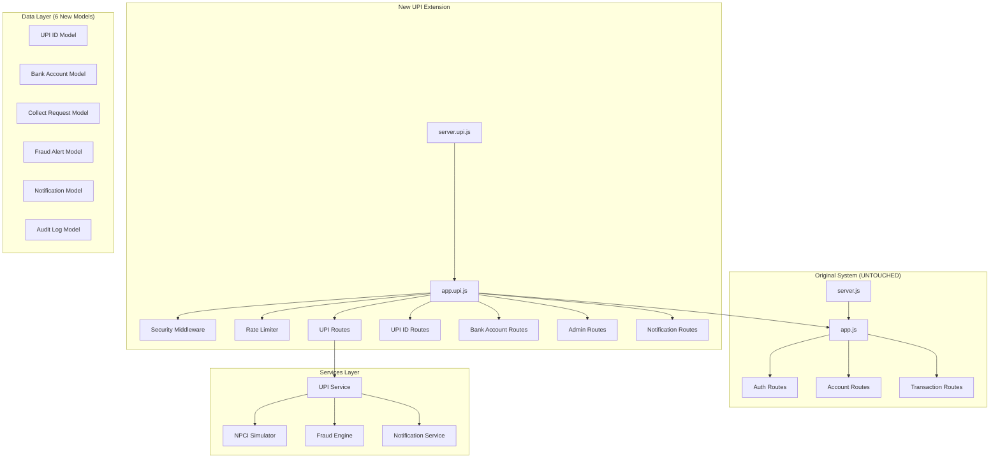

# UPI Banking System — Build Walkthrough

## Overview

Expanded the existing Backend-Ledger system into a **full-scale UPI Banking System** (GPay/PhonePe clone backend) — **25 new files** added, **zero existing files modified** (except `package.json` for a new script).

---

## Architecture



---

## Files Created (25 total)

### Config
| File | Purpose |
|------|---------|
| [upi.config.js](file:///d:/java/Backend-Ledger/src/config/upi.config.js) | All UPI constants — limits, VPA rules, NPCI settings, fraud thresholds |

### Models (6)
| File | Purpose |
|------|---------|
| [upiId.model.js](file:///d:/java/Backend-Ledger/src/models/upiId.model.js) | VPA management with uniqueness and soft-delete |
| [bankAccount.model.js](file:///d:/java/Backend-Ledger/src/models/bankAccount.model.js) | Bank linking with bcrypt PIN hashing + lockout |
| [collectRequest.model.js](file:///d:/java/Backend-Ledger/src/models/collectRequest.model.js) | Pull payment requests with auto-expiry |
| [fraudAlert.model.js](file:///d:/java/Backend-Ledger/src/models/fraudAlert.model.js) | Risk alerts with admin review workflow |
| [notification.model.js](file:///d:/java/Backend-Ledger/src/models/notification.model.js) | Multi-channel notifications with 90-day TTL |
| [auditLog.model.js](file:///d:/java/Backend-Ledger/src/models/auditLog.model.js) | Immutable audit trail (mirrors ledger immutability) |

### Services (4)
| File | Purpose |
|------|---------|
| [npci.service.js](file:///d:/java/Backend-Ledger/src/services/npci.service.js) | NPCI switch simulator with latency + 5% failure |
| [fraud.service.js](file:///d:/java/Backend-Ledger/src/services/fraud.service.js) | 6-rule risk scoring engine |
| [notification.service.js](file:///d:/java/Backend-Ledger/src/services/notification.service.js) | Unified multi-channel dispatcher |
| [upi.service.js](file:///d:/java/Backend-Ledger/src/services/upi.service.js) | Core orchestration — P2P, P2M, Collect flows |

### Middleware (3)
| File | Purpose |
|------|---------|
| [rateLimiter.middleware.js](file:///d:/java/Backend-Ledger/src/middleware/rateLimiter.middleware.js) | Per-IP/user rate limiting with auto-cleanup |
| [upiPin.middleware.js](file:///d:/java/Backend-Ledger/src/middleware/upiPin.middleware.js) | 2FA UPI PIN validation with lockout |
| [security.middleware.js](file:///d:/java/Backend-Ledger/src/middleware/security.middleware.js) | NoSQL injection + XSS + OWASP headers + logging |

### Controllers (4)
| File | Purpose |
|------|---------|
| [upi.controller.js](file:///d:/java/Backend-Ledger/src/controllers/upi.controller.js) | P2P, P2M, collect, refund, transaction history |
| [upiId.controller.js](file:///d:/java/Backend-Ledger/src/controllers/upiId.controller.js) | VPA CRUD + name resolution |
| [bankAccount.controller.js](file:///d:/java/Backend-Ledger/src/controllers/bankAccount.controller.js) | Bank linking + verification + PIN management |
| [admin.controller.js](file:///d:/java/Backend-Ledger/src/controllers/admin.controller.js) | System stats, fraud review, user blocking, audit logs |

### Routes (4)
| File | Purpose |
|------|---------|
| [upi.routes.js](file:///d:/java/Backend-Ledger/src/routes/upi.routes.js) | `/api/upi/*` endpoints |
| [upiId.routes.js](file:///d:/java/Backend-Ledger/src/routes/upiId.routes.js) | `/api/upi-id/*` endpoints |
| [bankAccount.routes.js](file:///d:/java/Backend-Ledger/src/routes/bankAccount.routes.js) | `/api/bank-accounts/*` endpoints |
| [admin.routes.js](file:///d:/java/Backend-Ledger/src/routes/admin.routes.js) | `/api/admin/*` endpoints |

### Integration (2)
| File | Purpose |
|------|---------|
| [app.upi.js](file:///d:/java/Backend-Ledger/src/app.upi.js) | Wraps original app + mounts all new routes |
| [server.upi.js](file:///d:/java/Backend-Ledger/src/server.upi.js) | UPI server entry point |

---

## Bugs Fixed

| Bug | Severity | Fix |
|-----|----------|-----|
| `sendEmail()` called before defined in notification.service.js | 🔴 CRASH | Replaced with `_sendGenericEmail()` helper defined before use |
| Fraud `checkDailyAmount` used ledger model (no timestamps) | 🔴 SILENT FAIL | Switched to transaction model which has `timestamps: true` |
| MongoDB aggregate queries used raw string IDs | 🟡 QUERY FAIL | Added `mongoose.Types.ObjectId()` casting in fraud.service.js |
| Fraud rules had no try-catch — one failure crashed all 6 | 🟡 CRASH | Each rule now wrapped in individual try-catch |
| MongoDB sessions leaked on transaction failure | 🔴 RESOURCE LEAK | Added `abortTransaction()` + `endSession()` in catch blocks |
| `setUpiPin` response always said "changed" | 🟡 UX BUG | Captured `wasPinAlreadySet` before mutation |
| `/notifications/unread-count` route matched after generic `/notifications` | 🟡 404 | Reordered: specific routes registered before generic |
| No CastError handler for invalid ObjectIds | 🟡 500 ERROR | Added CastError handler in global error middleware |
| `err.keyValue` could be null in duplicate key handler | 🟡 CRASH | Added null-safe access `err.keyValue \|\| {}` |

---

## Security & Privacy Features

| Feature | Implementation |
|---------|---------------|
| **NoSQL Injection Prevention** | Strips `$` operators from request body/query/params |
| **XSS Prevention** | Removes `<script>`, `<iframe>`, `on*=` handlers from input |
| **OWASP Security Headers** | X-Frame-Options, CSP, HSTS, X-Content-Type-Options |
| **UPI PIN Hashing** | bcrypt with 12 salt rounds, never stored in plaintext |
| **PIN Lockout** | 3 failed attempts → 30-minute lockout |
| **Sensitive Data Masking** | Passwords, PINs, tokens redacted in all logs |
| **Account Number Hashing** | SHA-256 hash for duplicate detection, only last 4 shown |
| **Immutable Audit Log** | Cannot be updated/deleted (compliance with RBI/PCI DSS) |
| **Per-IP Rate Limiting** | General (100/15min), Payment (20/15min), Auth (10/15min) |
| **Cache-Control Headers** | `no-store` prevents caching of sensitive API responses |

---

## API Endpoints (Full List)

### Original (Untouched)
- `POST /api/auth/register` — Register
- `POST /api/auth/login` — Login
- `POST /api/auth/logout` — Logout
- `POST /api/accounts` — Create account
- `POST /api/transactions` — Create transaction
- `POST /api/transactions/system/initial-funds` — Seed funds

### New — UPI Payments (`/api/upi`)
- `POST /api/upi/pay` — P2P payment
- `POST /api/upi/pay/merchant` — P2M payment
- `POST /api/upi/collect` — Create collect request
- `POST /api/upi/collect/:id/respond` — Approve/decline collect
- `GET  /api/upi/collect/pending` — Pending collects
- `GET  /api/upi/transactions` — Transaction history
- `POST /api/upi/refund` — Refund transaction

### New — UPI ID (`/api/upi-id`)
- `POST /api/upi-id/` — Create VPA
- `GET  /api/upi-id/` — List VPAs
- `GET  /api/upi-id/resolve/:vpa` — Resolve VPA to name
- `DELETE /api/upi-id/:vpa` — Deactivate VPA
- `PUT  /api/upi-id/:vpa/default` — Set default VPA

### New — Bank Accounts (`/api/bank-accounts`)
- `POST /api/bank-accounts/link` — Link bank account
- `GET  /api/bank-accounts/` — List linked accounts
- `POST /api/bank-accounts/:id/verify` — Penny drop verification
- `DELETE /api/bank-accounts/:id` — Unlink account
- `PUT  /api/bank-accounts/:id/primary` — Set primary
- `POST /api/bank-accounts/:id/set-pin` — Set/change UPI PIN

### New — Notifications (`/api/notifications`)
- `GET  /api/notifications` — Get notifications
- `GET  /api/notifications/unread-count` — Unread count
- `PUT  /api/notifications/read` — Mark as read

### New — Admin (`/api/admin`)
- `GET  /api/admin/stats` — System statistics
- `GET  /api/admin/transactions` — All transactions
- `GET  /api/admin/fraud-alerts` — Fraud dashboard
- `PUT  /api/admin/fraud-alerts/:id/review` — Review alert
- `POST /api/admin/users/:id/block` — Block user
- `POST /api/admin/users/:id/unblock` — Unblock user
- `GET  /api/admin/audit-logs` — Audit trail

### New — System
- `GET  /api/health` — Health check with module status

---

## How to Run

```bash
# Original ledger only (no UPI features)
npm run dev

# Full UPI Banking System
npm run dev:upi
```

---

## Verification

> [!IMPORTANT]
> The sandbox cannot run on Windows. To verify the server starts:
> ```bash
> cd d:\java\Backend-Ledger
> npm run dev:upi
> ```
> Then test the health endpoint: `GET http://localhost:3000/api/health`
